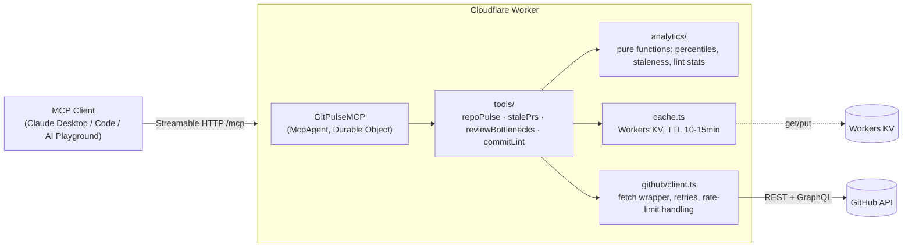

# gitpulse-mcp

A remote MCP (Model Context Protocol) server that exposes GitHub engineering-analytics
tools to LLM clients — Claude Desktop, Claude Code, the Cloudflare AI Playground, or any
MCP-compatible client. It answers three questions:

1. **Where are code reviews bottlenecked?** (time-to-first-review, time-to-merge, worst offenders)
2. **Which open PRs are at risk of going stale?** (no review activity past a threshold)
3. **Is our commit hygiene improving?** (% of commits matching a convention, trend over time)

Built as a portfolio project generalizing a commit-lint + CI enforcement tool
(`[A-Z]+-[0-9]+: description`) into a broader "engineering health" MCP server.

## Architecture



## Tools

### `get_repo_pulse(owner, repo, days = 30)`
Activity snapshot: PRs opened/merged/closed, commit count, active contributor count over
the window.

> "How active has `cloudflare/workers-sdk` been in the last 2 weeks?"

### `find_stale_prs(owner, repo, stale_after_days = 7)`
Open PRs with no activity past the threshold, sorted most-stale first (capped at 20).

> "Which open PRs on `vercel/next.js` haven't been touched in over a week?"

### `get_review_bottlenecks(owner, repo, days = 30)`
Median + p90 time-to-first-review and time-to-merge for recently merged PRs, plus the
5 slowest. Uses a single paginated GraphQL search query to avoid REST fan-out.

> "Where is code review slowest in `facebook/react` right now?"

### `lint_commit_history(owner, repo, days = 30, pattern = "^[A-Z]+-[0-9]+: .+")`
% of commits matching a regex convention, worst-offender authors, and week-over-week
trend. Pattern is compiled defensively (invalid regex and pathological length are
rejected before matching).

> "Is commit message hygiene improving on our repo month over month?"

Every tool returns shaped JSON plus a one-line `summary` string, and caches its result
in Workers KV (key: `toolName:sha256(args)`, TTL 10–15 min) to stay within GitHub's
rate limits.

## Design decisions

- **GraphQL only for `get_review_bottlenecks`.** Computing time-to-first-review per PR
  over REST would mean one request per PR (N+1) to fetch review timelines. GraphQL's
  `search` connection lets us pull merged PRs *and* their first review in one paginated
  query.
- **`find_stale_prs` uses `updated_at` as an activity proxy (v1).** The REST PR list
  endpoint doesn't expose "last review activity" directly; a more precise signal (last
  review/comment event) would require a timeline fetch per PR. Revisit if `updated_at`
  proves too noisy (e.g. bot-only pushes counting as activity).
- **Secrets never touch `vars`.** `GITHUB_TOKEN` is a `wrangler secret`, not a
  `wrangler.jsonc` var — the config file is committed to a public repo.

## Local development

```bash
npm install
cp .dev.vars.example .dev.vars   # then fill in a fine-grained PAT (public repo, read-only)
npm run dev                      # wrangler dev -> http://localhost:8787/mcp
npm test                         # vitest — analytics unit tests against fixture JSON
npm run typecheck                # tsc --noEmit
```

Connect a local MCP client with [`mcp-remote`](https://www.npmjs.com/package/mcp-remote)
pointed at `http://localhost:8787/mcp`, or use the
[Cloudflare AI Playground](https://playground.ai.cloudflare.com/) against the deployed URL.

## Deploying

```bash
wrangler kv namespace create GITPULSE_CACHE   # once, then paste the id into wrangler.jsonc
wrangler secret put GITHUB_TOKEN              # once per environment
npm run deploy
```

CI runs typecheck + tests on every PR and deploys to `workers.dev` on merge to `main`
(needs a `CLOUDFLARE_API_TOKEN` repo secret).

## Roadmap

- **Phase 1 (current): core server.** 4 tools, PAT auth, KV caching, fixture-based tests, CI/CD.
- **Phase 2: real auth.** Migrate to GitHub OAuth (per-user tokens, private-repo access), drop the shared PAT.
- **Phase 3: backfill/precompute.** Background jobs + persistence for large-repo history that times out at request time.
- **Phase 4: polish & publish.** Per-client rate limiting, basic metrics, a write-up analyzing a large OSS repo.

Not in scope (unless explicitly requested): dashboard UI, multi-repo org aggregation,
webhooks, write-access tools, non-GitHub forges.
